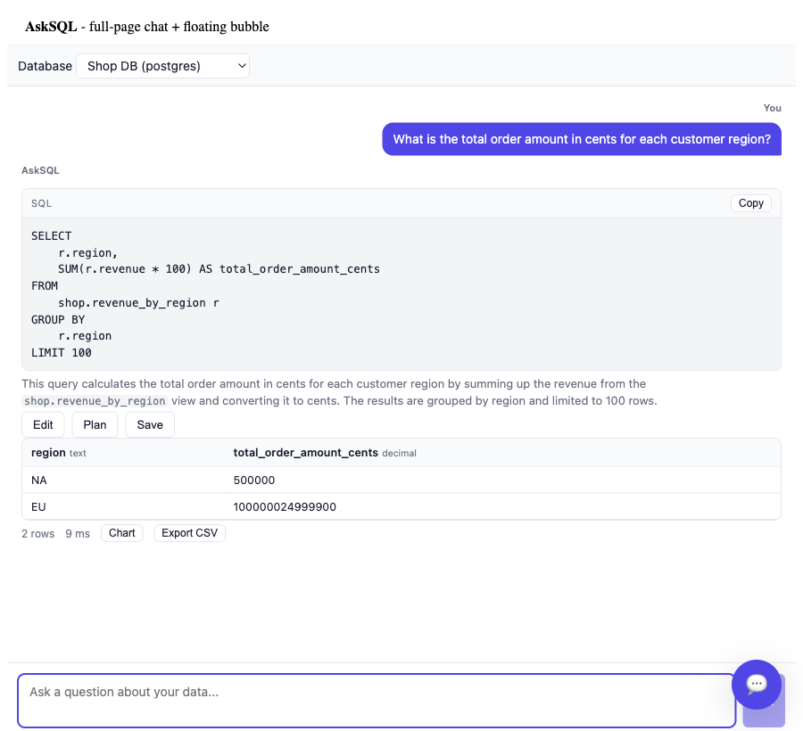
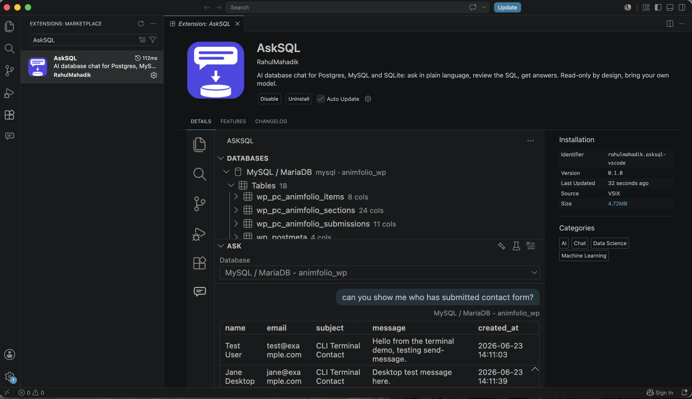
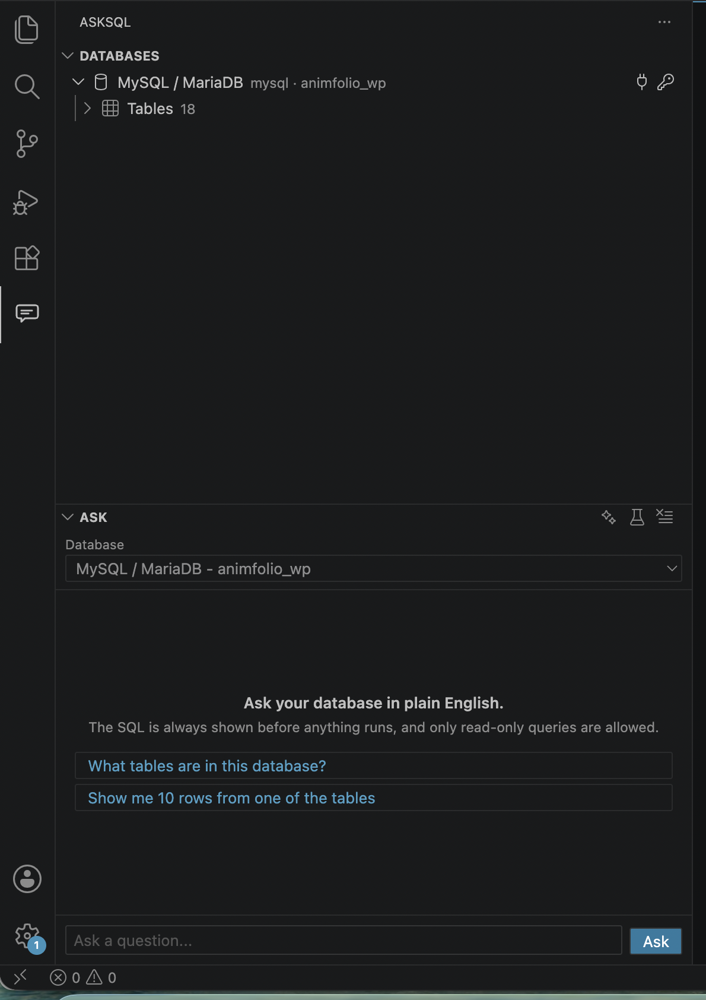
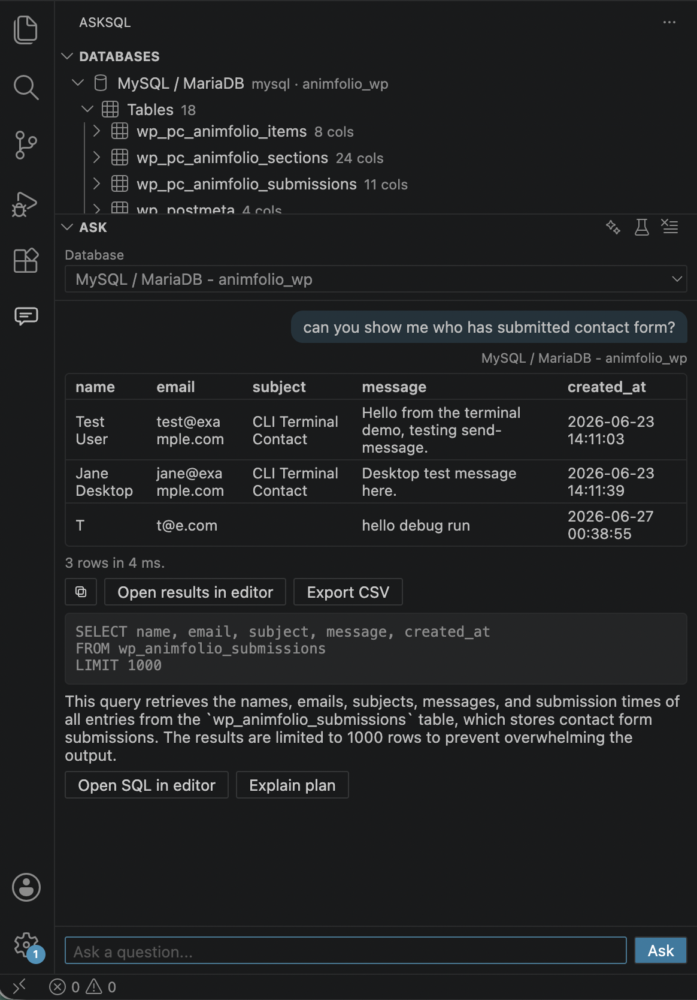

# AskSQL

*AI database chat: ask in plain language, review the SQL, get answers.*

[](https://github.com/rahulmahadik/AskSQL/actions/workflows/ci.yml)
[](https://www.npmjs.com/package/@asksql/core)
[](LICENSE)

All packages are published on npm under the [`@asksql`](https://www.npmjs.com/org/asksql) scope.

**Open-source, embeddable AI database chat.** Ask a question in plain language, review the
generated SQL, approve it, and get results - as a floating chat-head bubble you can drop into
any app, or a full-page chat UI, from one `npm install`.

```tsx
import { AskSqlChat, HttpTransport } from '@asksql/react';

const transport = new HttpTransport({ baseUrl: '/asksql' });
<AskSqlChat transport={transport} />
```

<p align="center">
  
  <br />
  <em>Ask in plain language, review the generated SQL, get results. (<a href="docs/screenshots/README.md">more screenshots</a>)</em>
</p>

## Use it in VS Code

Prefer a ready-made tool over the libraries? The **AskSQL** VS Code extension puts the same engine
and read-only guard in a sidebar panel: connect Postgres, MySQL / MariaDB or SQLite, ask in plain
language, and get answers without leaving your editor. Bring your own model - a chat model already in
VS Code, a local Ollama model, or your own OpenAI / Anthropic / Google / Groq key.

<p align="center">
  
</p>
<p align="center">
  
  
</p>

Install **AskSQL** from the VS Code Marketplace (or build the `.vsix` from `packages/vscode`). See the
[extension README](packages/vscode/README.md) for details.

## Why AskSQL

Most open-source text-to-SQL tools are Python libraries, hosted platforms, or standalone
apps. AskSQL is built for JS/TS developers instead: an **npm package you install and mount in
an afternoon**, self-hosted with your own LLM and your own database.

It fits three shapes of app without a rewrite - drop the `<AskSqlBubble/>` into an existing
product, mount `<AskSqlChat/>` as a full-page analytics tool, or build a custom surface on the
headless `useAskSql` hook. Postgres, MySQL, SQLite, and DuckDB (including CSV / Parquet / Excel
files queried in the browser) are first-class, and any OpenAI-compatible model works. Nothing
runs until a deterministic guard has proven the SQL is read-only.

- **Two surfaces, one engine** - `<AskSqlBubble/>` (Intercom-style chat head) and
  `<AskSqlChat/>` (full page), plus headless `useAskSql` for custom UIs.
- **Local-first** - upload CSV / JSON / Parquet / a portable SQL dump and query them in-process with DuckDB; run a
  fully local model with Ollama. Data and credentials never have to leave your infrastructure.
- **Verifiable safety** - read-only by default, a deterministic **AST-based SQL guard** (not
  regex), optional human approval before execution, and query audit.
- **Bring your own LLM** - OpenAI, Anthropic, Google Gemini, Azure OpenAI, **Groq**, Ollama, or
  any OpenAI-compatible endpoint, via the Vercel AI SDK.
- **Pay only for what you import** - per-database adapter packages; a MySQL-only app never
  downloads DuckDB's WASM or `pg`.

## How it fits together

```text
  Browser                         Your server                    Your database
  ---------------------           ----------------------         -------------------
  <AskSqlChat/>                    @asksql/server                 Postgres / MySQL /
  <AskSqlBubble/>   --HTTP/SSE-->  - auth hook (your login)       SQLite / DuckDB
  useAskSql  /  widget            - holds DB credentials
                                   - server-side guard
                                        |
                                        v
                                   @asksql/core (engine)
                                    1. introspect schema
                                    2. schema + question -----> LLM provider
                                       (no DB rows sent)   <----  generated SQL
                                    3. AST guard: read-only SELECT only
                                       (blocked -> refused, never runs)
                                    4. connector runs it in a read-only session --> DB
```

Credentials and the authoritative guard live on the server; the browser only ever sends a
question and renders results. The model sees your **schema and the question, never your rows**.

Client-only mode collapses this: `<AskSqlChat/>` talks straight to `@asksql/core` and a
DuckDB-WASM connector in the same tab, with no server and nothing leaving the browser.

## Quick start

New here? This is the whole thing, fully local - no cloud, no API key, no server. It points at a
SQLite file and a model running on your own machine through [Ollama](https://ollama.com).

```bash
# 1. Install: the engine + the SQLite adapter (and its driver) + the local-model SDK
npm i @asksql/core @asksql/sqlite better-sqlite3 @ai-sdk/openai-compatible

# 2. Get a local model (install Ollama first from ollama.com), then pull a small coder model:
ollama pull qwen2.5-coder:7b
```

```ts
import { createAskSql, resolveModel } from '@asksql/core';
import { SqliteConnector } from '@asksql/sqlite';

const connector = new SqliteConnector({ id: 'app', name: 'App', file: './app.db' });
const model = await resolveModel({ provider: 'ollama', model: 'qwen2.5-coder:7b' });
const engine = createAskSql({ connectors: [connector], model });

const answer = await engine.ask('How many rows are in each table?');
console.log(answer.sql);            // the SQL - always shown before it runs
console.log(await answer.run());    // guarded (read-only) + executed
```

That is a complete, private setup: your database and your model both stay on your machine, and
only the schema plus your question ever reach the model. When you want a chat UI add
`@asksql/react`; to keep DB credentials off the browser add the `@asksql/server` sidecar; to
query CSV / Parquet files in the browser use `@asksql/duckdb`. The rest of this README covers
each of those. Prefer a cloud model instead of Ollama? Swap step 2 for one `@ai-sdk/*` package
and an API key - see [Install only what your mode needs](#install-only-what-your-mode-needs).

## Packages

All packages publish under the [`@asksql`](https://www.npmjs.com/org/asksql) npm scope.

| Package | What it is |
|---------|------------|
| [`@asksql/core`](https://www.npmjs.com/package/@asksql/core) | Engine: schema catalog, AST guard, NL->SQL pipeline, provider resolver. No drivers. |
| [`@asksql/postgres`](https://www.npmjs.com/package/@asksql/postgres) [`@asksql/mysql`](https://www.npmjs.com/package/@asksql/mysql) [`@asksql/sqlite`](https://www.npmjs.com/package/@asksql/sqlite) [`@asksql/duckdb`](https://www.npmjs.com/package/@asksql/duckdb) | Database connectors (drivers are peer deps). |
| [`@asksql/server`](https://www.npmjs.com/package/@asksql/server) | Credential-holding sidecar: auth hook, server-side guard, SSE `/chat`. Express adapter included. |
| [`@asksql/react`](https://www.npmjs.com/package/@asksql/react) | `<AskSqlChat/>`, `<AskSqlBubble/>`, `useAskSql`, result table, CSV export. Light/dark. |
| [`@asksql/widget`](https://www.npmjs.com/package/@asksql/widget) | Vanilla-JS `<script>` embed (shadow-DOM isolated) for non-React pages. |
| [`@asksql/mcp`](https://www.npmjs.com/package/@asksql/mcp) | Model Context Protocol tools, so agents (Claude Desktop, IDEs) can query through the same guard. |

## Install only what your mode needs

Every setup is **three parts**, and you install only the ones you use:

1. **Engine** - `@asksql/core` (always).
2. **Data layer** - a database adapter + its driver (`@asksql/postgres` + `pg`, `@asksql/mysql`
   + `mysql2`, `@asksql/sqlite` + `better-sqlite3`), **or** `@asksql/duckdb` for browser
   file-analytics. Plus `@asksql/server` when you run the sidecar, and `@asksql/react` for the UI.
3. **Model-provider SDK** - one `@ai-sdk/*` package for the LLM you picked (see the table below).

Nothing outside those is pulled in - a MySQL-only app never downloads DuckDB's WASM or `pg`.

```bash
# Browser file analytics (CSV/JSON/Parquet, zero backend) with a local Ollama model:
npm i @asksql/core @asksql/react @asksql/duckdb @ai-sdk/openai-compatible

# Server sidecar over MySQL, using OpenAI:
npm i @asksql/core @asksql/server @asksql/react @asksql/mysql mysql2 @ai-sdk/openai

# Server sidecar over Postgres, using Groq:
npm i @asksql/core @asksql/server @asksql/react @asksql/postgres pg @ai-sdk/groq
```

Pick the **one** model-provider SDK that matches your `provider` - they are optional peer deps:

| `provider` | Install |
|------------|---------|
| `openai` | `@ai-sdk/openai` |
| `anthropic` | `@ai-sdk/anthropic` |
| `google` | `@ai-sdk/google` |
| `azure` (classic) | `@ai-sdk/azure` |
| `groq` | `@ai-sdk/groq` |
| `ollama`, `openai-compatible` (LM Studio, vLLM, OpenRouter, Azure AI Foundry, ...) | `@ai-sdk/openai-compatible` |

You pay for exactly what you import: install `@asksql/core` plus only the adapter(s) you use.
A MySQL-only app never pulls in DuckDB's WASM or `pg`.

## Databases

Four engines are first-class. Each connector introspects the schema (tables, views, columns,
keys, enums, indexes) and executes only guarded, read-only SQL. The driver is a peer
dependency you install yourself.

| Database | Package | Driver (peer) | How you connect |
|----------|---------|---------------|-----------------|
| PostgreSQL | `@asksql/postgres` | `pg` | `connectionString` (or `host`/`port`/`user`/`password`/`database`) |
| MySQL / MariaDB | `@asksql/mysql` | `mysql2` | `uri` + `database`, or `host`/`port`/`user`/`password`/`database` |
| SQLite | `@asksql/sqlite` | `better-sqlite3` (or `node:sqlite`) | `file` path, or pass an existing `database` handle |
| DuckDB | `@asksql/duckdb` | `@duckdb/node-api` (Node) / `@duckdb/duckdb-wasm` (browser) | `path` (`:memory:` default) and/or `files` to register CSV/JSON/Parquet/Excel/`.sql` as tables (each data file or Excel `sheet` becomes its own joinable table; a portable `.sql` dump runs its CREATE + INSERT and exposes the tables it builds) |

```ts
new PostgresConnector({ id: 'shop', name: 'Shop', connectionString: process.env.DATABASE_URL });
new MysqlConnector({ id: 'app', name: 'App', uri: process.env.DATABASE_URL, database: 'app' });
new SqliteConnector({ id: 'local', name: 'Local', file: './app.db' });
new DuckDbConnector({ id: 'files', name: 'Files', files: [{ table: 'sales', path: 'sales.csv', format: 'csv' }] });
```

Connectors open **read-only** sessions where the engine supports it, so the AST guard has a
second line of defense at the database itself. Registering multiple connectors lets one engine
answer questions across several databases. Credentials belong on the server sidecar, never in
the browser.

## Two ways to run

**Client-only (zero backend)** - files + DuckDB in the browser, model called directly:

```ts
import { createAskSql, resolveModel } from '@asksql/core';
import { DuckDbConnector } from '@asksql/duckdb';

const connector = new DuckDbConnector({ id: 'files', name: 'Files',
  files: [{ table: 'sales', path: 'sales.csv', format: 'csv' }] });
const model = await resolveModel({ provider: 'ollama', model: 'qwen2.5-coder:7b',
  baseURL: 'http://localhost:11434/v1' });
const engine = createAskSql({ connectors: [connector], model });

const answer = await engine.ask('Which region has the highest sales?');
console.log(answer.sql);            // reviewed before it runs
const result = await answer.run();  // guarded + executed
```

**Server sidecar** - credentials stay server-side, browser talks HTTP:

```ts
import express from 'express';
import { asksqlMiddleware } from '@asksql/server/express';
import { PostgresConnector } from '@asksql/postgres';
import { resolveModel } from '@asksql/core';

const app = express();
app.use(express.json());
app.use('/asksql', asksqlMiddleware({
  connectors: [new PostgresConnector({ id: 'shop', name: 'Shop', connectionString: process.env.DATABASE_URL })],
  engine: { model: await resolveModel({ provider: 'groq', model: 'llama-3.3-70b-versatile', apiKey: process.env.GROQ_API_KEY }) },
  auth: (req) => ({ userId: lookUpSession(req), allowedConnectionIds: ['shop'] }), // your auth
}));
```

## Configuration

**Model providers** - OpenAI, Anthropic, Gemini, Azure (classic + AI Foundry), Groq, Ollama, or
any OpenAI-compatible endpoint. See **[docs/providers.md](docs/providers.md)** for per-provider
config (including the Azure classic-vs-Foundry gotcha).

Prompts and model sampling are host-configurable - no forking required.

**Prompts** (`config.prompts`) - extend or fully replace the system prompt:

```ts
const engine = createAskSql({
  connectors: [connector],
  model,
  prompts: {
    // Append house rules to the built-in prompt:
    instructions: 'Prefer CTEs over subqueries. Alias every aggregate.',
    // ...or replace it entirely (you own correctness guidance - the AST guard
    // still enforces read-only regardless of what the prompt says):
    // system: ({ dialectLabel, maxRows }) => `You are a ${dialectLabel} analyst...`,
  },
});
```

**Model sampling** (`config.llm`) - every knob is optional; unset ones fall back
to the provider default, and `temperature` defaults to `0` (deterministic, best
for SQL):

```ts
const engine = createAskSql({
  connectors: [connector],
  model,
  llm: {
    temperature: 0,          // 0 = deterministic (default)
    topP: 0.9,               // nucleus sampling (prefer temperature OR topP)
    topK: 40,                // where the provider supports it
    frequencyPenalty: 0.2,
    presencePenalty: 0,
    seed: 42,                // reproducible sampling where supported
    stopSequences: ['\n\n'],
    maxRetries: 2,           // retries on 429 / 5xx / network (default 2)
    timeoutMs: 60000,        // per-call timeout (default 60s)
    maxOutputTokens: 1024,   // cap the completion length
    // Escape hatch for provider-specific knobs (reasoning effort, etc.):
    providerOptions: { groq: { reasoning_format: 'hidden' } },
  },
});
```

**Guard policy** (`config.policy`) - the read-only floor is immovable, but the limits
around it are yours to set:

```ts
const engine = createAskSql({
  connectors: [connector],
  model,
  policy: {
    maxRows: 1000,               // LIMIT injected when missing / lowered when higher
    denyFunctions: ['pg_sleep'], // extra names blocked on top of the built-in denylist
    allowFileFunctions: false,   // read_csv/read_parquet - true only for browser DuckDB
    maxSqlLength: 100000,        // reject pathologically long SQL
    maxDepth: 400,               // parser recursion cap (fails closed)
  },
});
```

**Grounding** - two optional inputs make generation sharper without touching the guard:

```ts
const engine = createAskSql({
  connectors: [connector],
  model,
  // Define house vocabulary so "MRR" or "active user" map to real columns:
  glossary: [{ term: 'active user', definition: 'a user with an event in the last 30 days' }],
  // Approved question -> SQL pairs are retrieved as few-shots on later asks:
  fewShots: new MemoryFewShotStore(),
});
// After a user approves an answer, teach the engine (only stored if it passes the guard):
await engine.recordFeedback('top customers by revenue', approvedSql, { connectionId: 'shop' });
```

## Model Context Protocol (MCP)

`@asksql/mcp` exposes the same guarded engine to MCP clients (Claude Desktop, IDE agents),
so an assistant can explore and query your database through the identical read-only guard -
a `DELETE` still comes back `GUARD_BLOCKED`.

```bash
npm i @asksql/core @asksql/mcp @modelcontextprotocol/sdk
```

```ts
import { createAskSql } from '@asksql/core';
import { startAskSqlMcpServer } from '@asksql/mcp';

const engine = createAskSql({ connectors: [/* ... */], model });
await startAskSqlMcpServer(engine); // speaks MCP over stdin/stdout
```

Four tools are advertised: `asksql_list_connections`, `asksql_schema`, `asksql_query`
(question -> SQL, no execution), and `asksql_run` (execute an approved read-only SELECT).
`createAskSqlMcpTools(engine)` returns the raw tool defs for a custom transport; the SDK is an
optional peer, needed only by `startAskSqlMcpServer`. See
[packages/mcp/README.md](packages/mcp/README.md).

## What else is in the box

Beyond ask -> approve -> run, the engine and server ship these (all optional):

- **EXPLAIN in plain language** - `engine.explain(sql)` / `useAskSql().planFor()` / server
  `POST /explain` return a natural-language read of the query plan.
- **Streaming progress** - `config.onEvent` (and per-ask `onEvent`) emits stage + token events
  across the pipeline (`catalog`, `prompt`, `llm`, `guard`, `execute`, ...) for live UIs.
- **Cancellation** - pass an `AbortSignal` to any ask/run/explain; `useAskSql().cancel()` stops
  in flight, and Postgres/MySQL cancel the running query at the database.
- **Hallucination floor** - before a query runs, the engine deterministically checks every
  referenced table *and* column against your schema; if the model invents or mis-guesses a
  column (a common small-model slip), it is handed the real column list and re-asked, so the
  fix happens before the database ever sees the query. The schema is also auto-shrunk and
  retried once on context overflow.
- **Suggested fix on failure** - if a query still fails at the database, the server asks the
  model for a corrected query and returns it as a suggestion; the UI shows an **"Apply suggested
  fix"** button so the user can review and re-run it (it never auto-runs). Toggle with the
  server's `suggestFixOnError` option (default on; set false to disable the extra model call).
- **Follow-up context** - prior turns are threaded into the prompt so "now break that down by
  month" works; the UI sends the last few turns automatically.
- **Query history + audit** - `config.history` records every attempt (status, tokens, duration)
  behind a paginated `GET /history`; `config.audit` is a pluggable sink with the guard verdict.
- **Saved queries** - `useSavedQueries` / `SavedQueryStore` pin and reuse questions
  (localStorage-backed, SSR-safe).
- **Schema pruning + token budget** - large catalogs are pruned to the most relevant tables
  under a token budget (`config.pruner`) before prompting.
- **Privacy by default** - only the schema is ever sent; `allowDataInPrompt` (default off) is
  the explicit opt-in to include sampled cell values in repair prompts.
- **Server hardening** - `GET /health`, a request-body size cap (`maxBodyBytes`), and built-in
  `cors` handling on the Express adapter.

## Customizing the UI

The UI is override-friendly at four levels, lightest to fully custom:

**Theme with CSS variables** - restyle without touching components. Override any of
`--aq-accent`, `--aq-bg`, `--aq-surface`, `--aq-fg`, `--aq-muted`, `--aq-border`,
`--aq-code-bg`, `--aq-ok`, `--aq-warn`, `--aq-danger`, `--aq-shadow` (and `--aq-accent-fg`),
and set `theme="light" | "dark" | "auto"`.

**Component props** - `<AskSqlChat>` takes `placeholder`, `suggestions`, `requireApproval`,
`showConnectionPicker`, `connectionId`, and `nonce` (CSP); `<AskSqlBubble>` adds `title`,
`icon`, `position`, `offset`, and `zIndex`. The vanilla widget's `AskSQL.mount()` takes the
same `theme` / `title` / `position` / `offset` / `zIndex`.

**Compose the building blocks** - `<ResultTable>`, `<SqlBlock>`, `<SchemaBrowser>`, and
`<ResultChart>` (plus the `formatCell` / `toCsv` helpers) are exported standalone, so you can
lay out your own surface while keeping our rendering.

**Go fully headless** - `useAskSql` gives you the entire ask -> approve -> run state machine
with zero markup; render your own UI on top while the engine and guard still run underneath:

```tsx
import { useAskSql } from '@asksql/react';

function MyChat({ transport }) {
  const { turns, busy, ask, run, editSql } = useAskSql({ transport, requireApproval: true });
  // Render turns / SQL / results however you like; approval + guard still apply.
}
```

## Safety model

The LLM is untrusted input. A deterministic guard - not the prompt - decides what runs:

- Single read-only `SELECT` only (CTEs verified recursively); every write/DDL form, stacked
  statement, data-modifying CTE, `SELECT INTO`, locking clause, `INTO OUTFILE`, and a
  per-dialect dangerous-function denylist are **blocked**. Anything unparseable fails closed.
- Runs client-side for UX **and** server-side for authority; connectors also open read-only DB
  sessions, so a bypass still hits a read-only transaction.
- Row caps injected automatically; the generated SQL is always shown before it runs, and an
  optional `requireApproval` gate can hold every query behind a Run button; every query (and
  every block) is recorded.

The guard is developed test-first: its full case coverage - every blocked write/DDL/obfuscation
form plus property-based fuzzing - lives in the `guard-security` and `guard-fuzz` suites under
`packages/core/test/`.

## Accuracy depends on the model and the question

Be clear-eyed about what AskSQL guarantees. The guard guarantees **safety** - the SQL is
read-only and is shown to you before it runs. It does **not** guarantee the query is
**semantically** what you meant. How good the generated SQL is depends on two things:

- **How capable your model is.** AskSQL is built to run fully offline on a local coder model. In
  our testing a **7B** (for example `qwen2.5-coder:7b`) is the sweet spot - it matched a 14B on
  multi-join analytics while running about twice as fast, and it is easy to run locally. A 14B
  gives a little more headroom on the hardest questions; a tiny 1.5B-3B is fine for simple,
  small-schema questions but slips on complex joins. Pick a local model sized to your workload -
  and if you ever need to, a cloud model is an option for the heaviest analytics, never a
  requirement.
- **How complex the question is.** Single-table filters and simple joins are reliable across the
  board. But multi-table analytics - especially aggregating measures across several
  one-to-many tables at once - can trip a smaller model into a classic **join fan-out**
  (summing over a row-multiplied result and inflating the total), or a hallucinated column, even
  though the SQL is valid and the guard passes.

**Rule of thumb, from real testing.** The more tables a question must join, and the larger or
more inconsistently-named your schema, the more model capability you need:

| Your situation | What to use |
|----------------|-------------|
| Small, clean schema; simple or few-table questions | A 1.5B-3B is fine (it handled a 5-table join on a tidy schema in our tests). |
| Complex schema (many tables), questions needing several joins | Use **7B or larger**. A 1.5B failed outright on a real 63-table schema; a 7B matched a 14B. |
| Very deep joins (4+ tables) on an inconsistently-named schema | Even a 14B can slip on a wrong column - review the SQL, and prefer consistent naming (`service_id`, not `id`). |

So yes: **if your schema is complicated and your questions need many joins, a small model will
struggle** - reach for a 7B (the sweet spot for reliable results) or larger, and do not expect a
1.5B-3B to get it right on a big, messy schema.

Practical guidance: **review the generated SQL** (it is always shown first; set
`requireApproval` to force a click), give heavy analytics a more capable local model, and treat
the numbers on complex multi-join aggregations as draft until you have sanity-checked them.
Prompt guidance (`config.prompts.instructions`) and a larger model both help; neither makes
review optional.

## Examples

- **`examples/browser-duckdb`** - no backend at all: upload a CSV, ask questions, everything
  runs in the tab via DuckDB-WASM. Nothing leaves the browser. ([screenshot](docs/screenshots/README.md))
- `examples/node-duckdb` - headless file analytics with a real model.
- `examples/express-postgres` - sidecar + static page over live Postgres.
- `examples/vite-react` - the React app (bubble + full page).
- `examples/plain-html` - one `<script>` tag, `AskSQL.mount(...)`.

Runs on any OS (macOS/Linux/Windows) and any modern browser - the browser connector uses only
standard Web Worker / OPFS / File APIs.

## FAQ

Common questions - data privacy, supported databases, free and local LLM options, accuracy vs
model choice, big schemas, multi-database, safety, and production-readiness - are answered in
[docs/FAQ.md](docs/FAQ.md).

## Development

See [CONTRIBUTING.md](CONTRIBUTING.md) for the full setup, test gating, and code standards.

```bash
pnpm install
pnpm test           # unit + live-DB + browser + (with GROQ_API_KEY) live-AI
pnpm typecheck
pnpm build
```

## License

Apache-2.0
