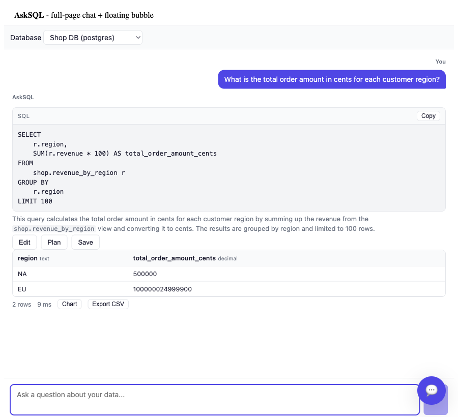

# AskSQL

*Ask your database a question in plain English. Review the SQL. Approve it. Get the answer.*

[](https://github.com/rahulmahadik/AskSQL/actions/workflows/ci.yml)
[](https://www.npmjs.com/package/@asksql/core)
[](https://marketplace.visualstudio.com/items?itemName=RahulMahadik.asksql-vscode)
[](https://plugins.jetbrains.com/plugin/33126-asksql)
[](LICENSE)

AskSQL turns your question into a SQL query, shows you the query and a short explanation,
and runs it only after you approve. It is read-only by design: a deterministic guard refuses
anything that is not a SELECT, so asking it to delete rows gets you the statement written
out as text to run yourself, never executed.

It works with PostgreSQL, MySQL / MariaDB, SQLite, DuckDB, Oracle, and MongoDB. You bring
your own model: a local one through [Ollama](https://ollama.com), or an OpenAI, Anthropic,
Google Gemini, Azure, Groq, NVIDIA, or any OpenAI-compatible key. Everything is self-hosted,
with no telemetry; the model sees your schema and your question, never your rows.

<p align="center">
  
  <br />
  <em>Ask in plain language, review the generated SQL, get results. (<a href="docs/screenshots/README.md">more screenshots</a>)</em>
</p>

## Get it

The same engine and guard, on four surfaces:

| Where you work | Install |
|---|---|
| JetBrains IDEs (IntelliJ, DataGrip, PyCharm, ...) | [JetBrains Marketplace](https://plugins.jetbrains.com/plugin/33126-asksql) |
| VS Code | [VS Code Marketplace](https://marketplace.visualstudio.com/items?itemName=RahulMahadik.asksql-vscode) |
| Edge / Chrome | Browser extension: build it from [`packages/browser-extension`](packages/browser-extension/README.md) |
| Your own app or server | `npm i @asksql/core` plus [`@asksql/react`](https://www.npmjs.com/package/@asksql/react), [`@asksql/server`](https://www.npmjs.com/package/@asksql/server), [`@asksql/widget`](https://www.npmjs.com/package/@asksql/widget) and the per-database connectors, all under the [`@asksql`](https://www.npmjs.com/org/asksql) npm scope |

Most people want one of the first three. If you are building your own product, the npm
packages give you the same engine as an embeddable chat: a floating chat-head bubble, a
full-page chat UI, or a headless hook. The rest of this README covers that path.

```tsx
import { AskSqlChat, HttpTransport } from '@asksql/react';

const transport = new HttpTransport({ baseUrl: '/asksql' });
<AskSqlChat transport={transport} />
```

## JetBrains IDEs

A pure Kotlin/JVM port of the engine and guard for IntelliJ IDEA, DataGrip, PyCharm, and the
rest of the family: six databases, local or hosted models, read-only by design. Install it from
the [JetBrains Marketplace](https://plugins.jetbrains.com/plugin/33126-asksql); setup and
screenshots: [plugin README](packages/jetbrains/README.md).

## VS Code

The same engine in a sidebar panel: connect Postgres, MySQL / MariaDB, SQLite, Oracle or
MongoDB and ask without leaving the editor, using a chat model already in VS Code, a local
Ollama model, or your own API key. Install it from the
[VS Code Marketplace](https://marketplace.visualstudio.com/items?itemName=RahulMahadik.asksql-vscode);
details: [extension README](packages/vscode/README.md).

## Browser extension

The Edge / Chrome extension puts the chat in the browser's side panel. Point it at data files
(CSV, JSON, Parquet, Excel, or a `.sql` dump) analyzed entirely in-tab with DuckDB-WASM, or at
an `@asksql/server` sidecar to reach a real database. Build it from
[`packages/browser-extension`](packages/browser-extension/README.md).

## npm libraries

Where most open-source text-to-SQL tools are Python libraries or hosted platforms, AskSQL is an
npm package for JS/TS developers, self-hosted with your own LLM and your own database. Mount
`<AskSqlBubble/>` in an existing product, `<AskSqlChat/>` as a full-page tool, or build on the
headless `useAskSql` hook; the [`@asksql/server`](packages/server/README.md) sidecar keeps
credentials off the browser. Start with the [`@asksql/react` README](packages/react/README.md),
then [docs/deployment.md](docs/deployment.md) for how it fits together, the two ways to run,
the per-mode install matrix, and the runnable `examples/`.

## Databases

Six engines are first-class. Each connector introspects the schema and executes only guarded,
read-only queries; the driver is a peer dependency you install yourself.

| Database | Package | Driver (peer) | How you connect |
|----------|---------|---------------|-----------------|
| PostgreSQL | `@asksql/postgres` | `pg` | `connectionString` (or `host`/`port`/`user`/`password`/`database`) |
| MySQL / MariaDB | `@asksql/mysql` | `mysql2` | `uri` + `database`, or `host`/`port`/`user`/`password`/`database` |
| SQLite | `@asksql/sqlite` | `better-sqlite3` (or `node:sqlite`) | `file` path, or pass an existing `database` handle |
| DuckDB | `@asksql/duckdb` | `@duckdb/node-api` (Node) / `@duckdb/duckdb-wasm` (browser) | `path` (`:memory:` default) and/or `files` to register CSV/JSON/Parquet/Excel/`.sql` as tables (each data file or Excel `sheet` becomes its own joinable table; a portable `.sql` dump runs its CREATE + INSERT and exposes the tables it builds) |
| Oracle | `@asksql/oracle` | `oracledb` (pure-JS Thin mode) | `host`/`port`/`user`/`password`/`database` (service name), or a `connectString` |
| MongoDB | `@asksql/mongodb` | `mongodb` | `connectionString` (`mongodb://` or `mongodb+srv://`) + `database` |

MongoDB is non-SQL: pass `MongodbConnector` to `createMongoAskSql` from `@asksql/core/mongo`;
the flow is the same ask, guard, run, but over aggregation pipelines. Registering multiple
connectors lets one engine answer questions across several databases.

## Read-only by design

The LLM is untrusted input; a deterministic AST-based guard, not the prompt, decides what runs.
Only a single read-only SELECT passes, along with EXPLAIN of one and the read-only PRAGMA/SHOW
forms: every write and DDL form, stacked statement, and dangerous function is blocked, and
anything unparseable fails closed. Where the engine supports it (Postgres, MySQL, SQLite,
Oracle) the connector also opens a read-only session as a backstop, and the generated SQL is
always shown before it runs (`requireApproval` adds a Run button). The
guard's full case coverage is the `guard-security` and `guard-fuzz` suites under
`packages/core/test/`; [docs/FAQ.md](docs/FAQ.md) covers the safety model in detail.

## Packages

| Package | What it is |
|---------|------------|
| [`@asksql/core`](https://www.npmjs.com/package/@asksql/core) | Engine: schema catalog, AST guard, NL->SQL pipeline, provider resolver. No drivers. |
| [`@asksql/postgres`](https://www.npmjs.com/package/@asksql/postgres) [`@asksql/mysql`](https://www.npmjs.com/package/@asksql/mysql) [`@asksql/sqlite`](https://www.npmjs.com/package/@asksql/sqlite) [`@asksql/duckdb`](https://www.npmjs.com/package/@asksql/duckdb) [`@asksql/oracle`](https://www.npmjs.com/package/@asksql/oracle) [`@asksql/mongodb`](https://www.npmjs.com/package/@asksql/mongodb) | Database connectors (drivers are peer deps). |
| [`@asksql/server`](https://www.npmjs.com/package/@asksql/server) | Credential-holding sidecar: auth hook, server-side guard, SSE `/chat`. Express adapter included. |
| [`@asksql/react`](https://www.npmjs.com/package/@asksql/react) | `<AskSqlChat/>`, `<AskSqlBubble/>`, `useAskSql`, result table, CSV export. Light/dark. |
| [`@asksql/widget`](https://www.npmjs.com/package/@asksql/widget) | Vanilla-JS `<script>` embed (shadow-DOM isolated) for non-React pages. |
| [`@asksql/mcp`](https://www.npmjs.com/package/@asksql/mcp) | Model Context Protocol tools, so agents (Claude Desktop, IDEs) can query through the same guard. See [packages/mcp](packages/mcp/README.md). |

**API reference (TypeDoc):** [rahulmahadik.github.io/AskSQL](https://rahulmahadik.github.io/AskSQL/)

## Quick start

The whole thing, fully local: a SQLite file and a model on your own machine through Ollama.
No cloud, no API key, no server.

```bash
npm i @asksql/core @asksql/sqlite @ai-sdk/openai-compatible  # Node 22.5+ needs no sqlite driver
ollama pull qwen2.5-coder:7b                                 # install Ollama first: ollama.com
```

```ts
import { createAskSql, resolveModel } from '@asksql/core';
import { SqliteConnector } from '@asksql/sqlite';

const connector = new SqliteConnector({ id: 'app', name: 'App', file: './app.db' });
const model = await resolveModel({ provider: 'ollama', model: 'qwen2.5-coder:7b' });
const engine = createAskSql({ connectors: [connector], model });

const answer = await engine.ask('How many rows are in each table?');
console.log(answer.sql);            // the SQL - always shown before it runs
console.log(await answer.run());    // guarded (read-only) + executed
```

Your database and your model both stay on your machine; only the schema and your question ever
reach the model. From here, add `@asksql/react` for a chat UI, `@asksql/server` to keep
credentials off the browser, or a cloud model by swapping the `resolveModel` line
([docs/providers.md](docs/providers.md)). Prompts, model sampling, guard limits, and grounding
are all configurable: [docs/configuration.md](docs/configuration.md).

## Development

See [CONTRIBUTING.md](CONTRIBUTING.md) for the full setup, test gating, and code standards.

```bash
pnpm install
pnpm test           # unit + live-DB + browser + (with GROQ_API_KEY) live-AI
pnpm typecheck
pnpm build
```

## License

Apache-2.0
