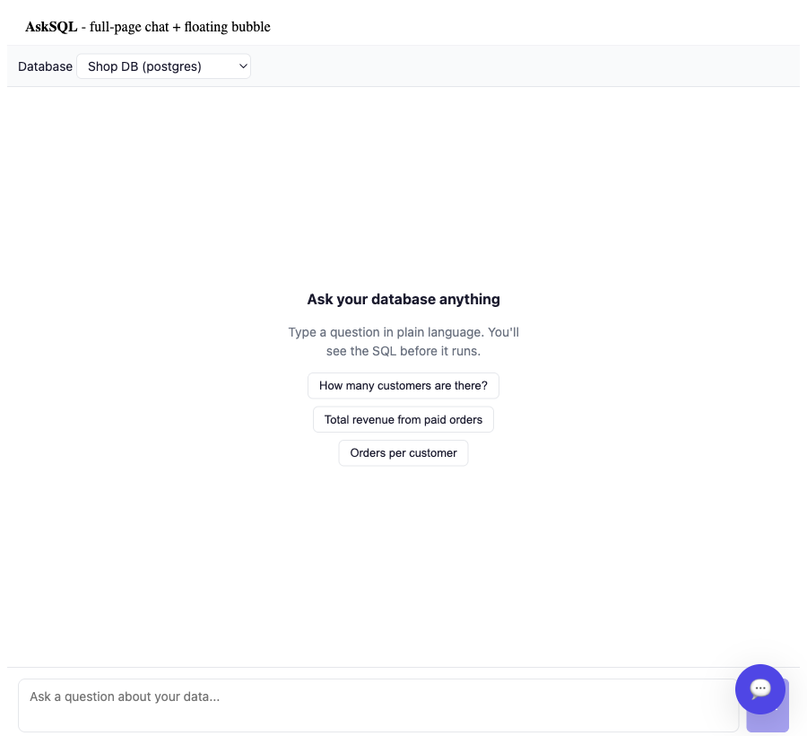
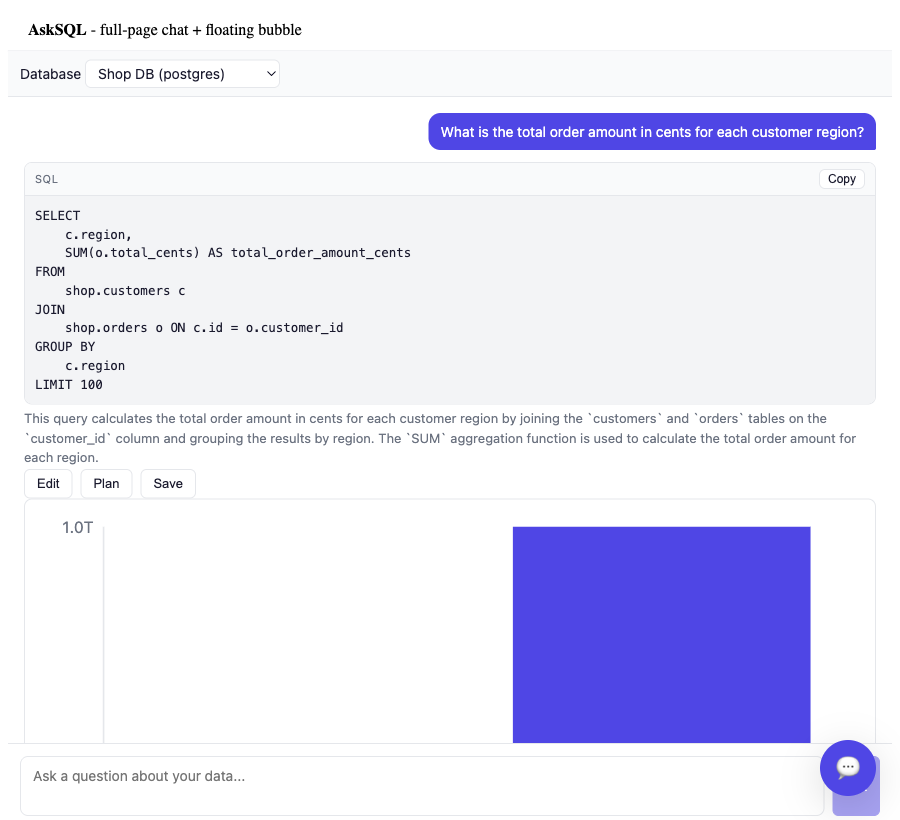
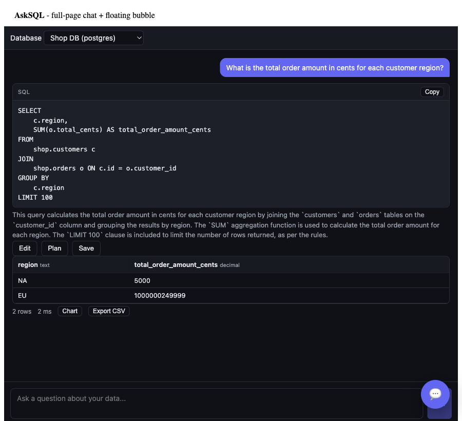
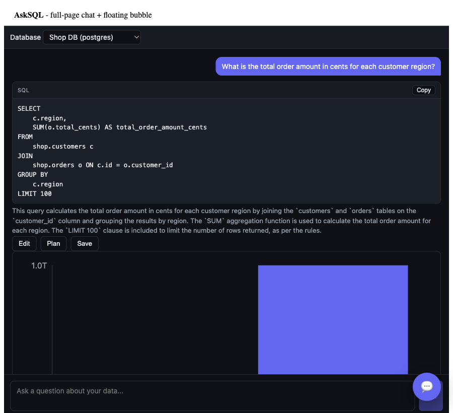
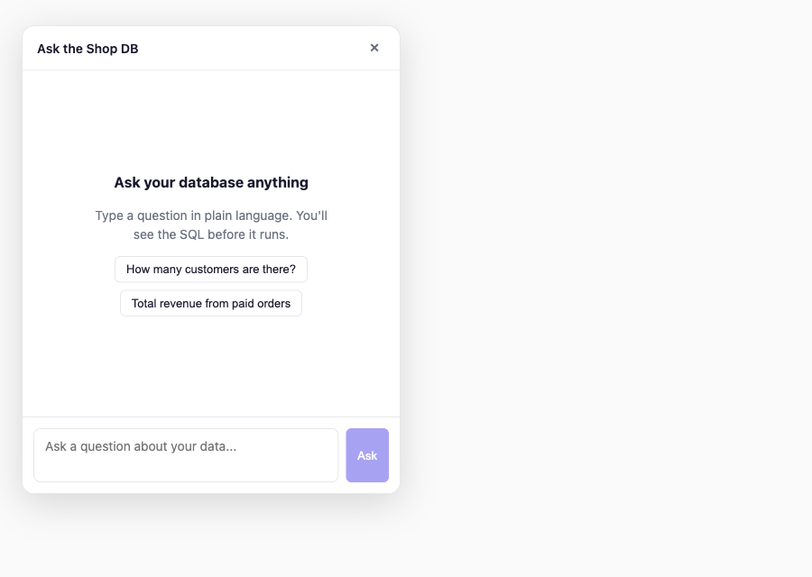
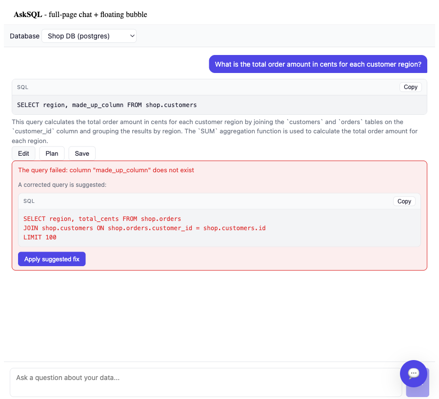
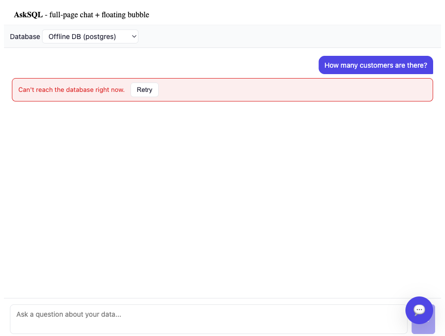
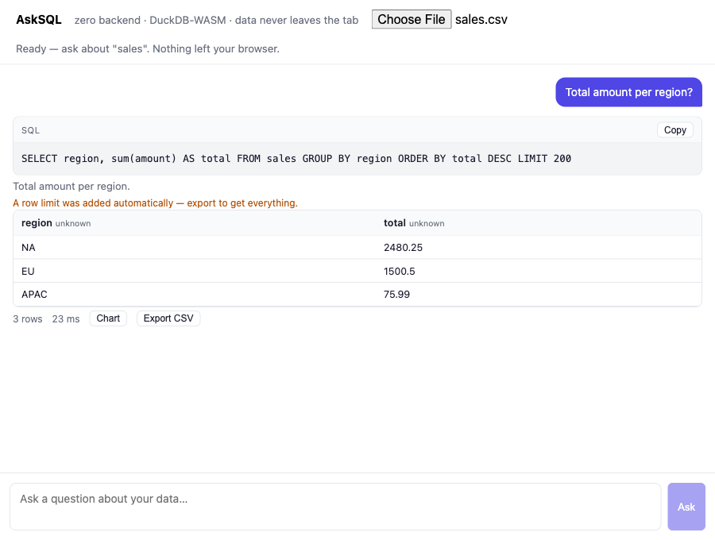

# AskSQL - real screenshots

Captured from the **actual running app** in headless Chrome:
Chrome -> built Vite bundle -> Express sidecar -> live PostgreSQL -> Groq
(`llama-3.3-70b`).

### Full-page chat - ask, review SQL, results (light)
Connection picker (two DBs), the generated SQL shown before it runs, the plain-language
explanation, and the result table. Note the BIGINT value `1000000249999` preserved exactly.

### One-click chart from the same result
The result is category + numeric, so a **Chart** toggle appears; the bar chart is inline SVG,
theme-aware (y-axis auto-formats to `1.0T`).

### Dark mode (automatic via `prefers-color-scheme`)

### Floating chat-head bubble - placed clear of host UI
The host page has a bottom-right "scroll to top" button, so the bubble is mounted
**bottom-left** (`position: 'bottom-left'`) - no overlap. Closed, then open:

### Suggested fix on a failed query
When a run fails (here an edited query references a column that does not exist), the error is
plain-language and the app offers a **corrected query** with an "Apply suggested fix" button -
it never auto-runs.

### Clean, retryable errors
An unreachable connection surfaces a plain "Can't reach the database right now." with a **Retry**
button - no stack trace, no frozen UI.

### Zero-backend, in the browser (the product wedge)
Upload a CSV, ask a question - DuckDB-WASM parses and queries it in a Web Worker, the
engine + guard run client-side, and **nothing leaves the tab**. The result
(`NA = 2480.25`, computed in-browser) proves the whole loop with no server.

