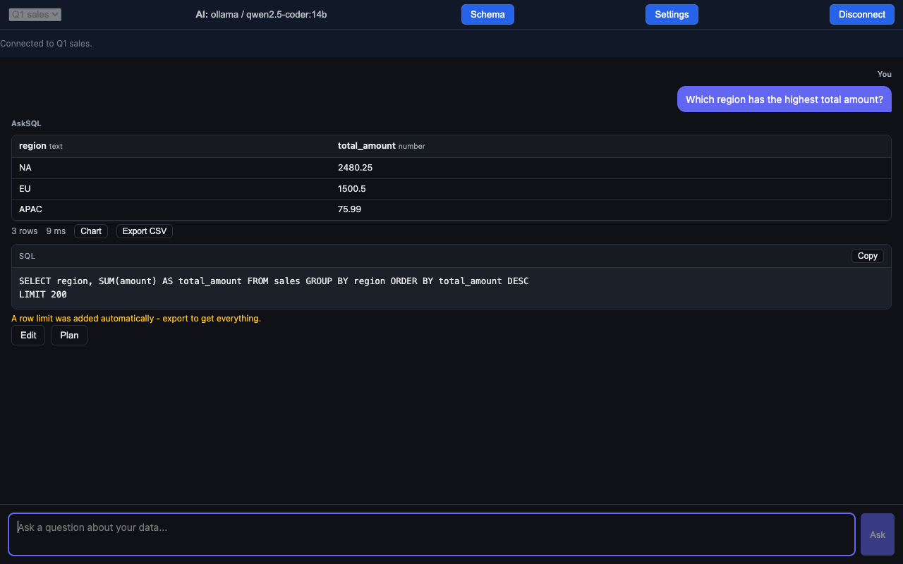
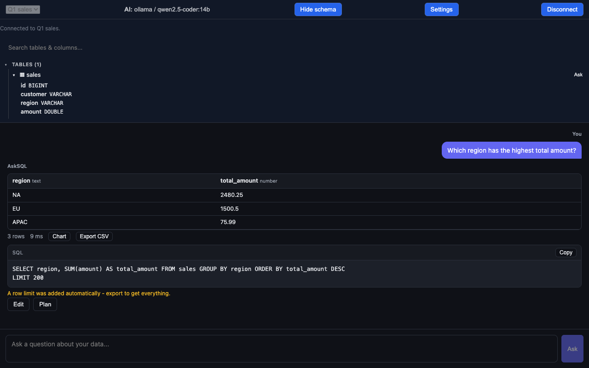
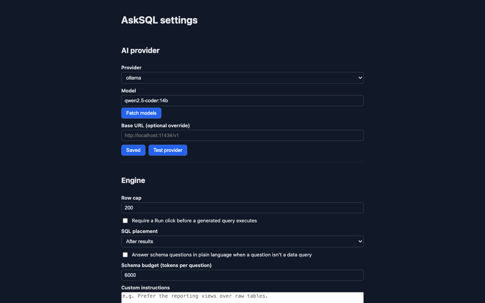
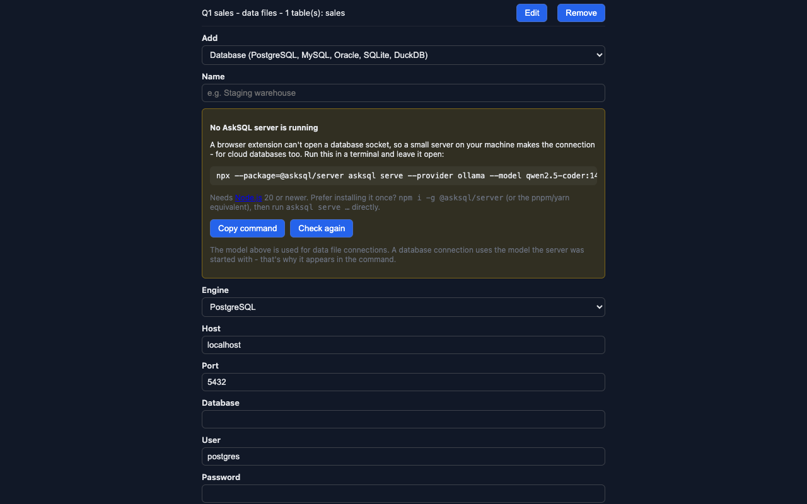

# AskSQL for Edge and Chrome

**Ask your database in plain English, right from the browser's side panel.**

You add connections in Settings and pick one from a dropdown in the side panel, the
same way the AskSQL JetBrains plugin works. There are two kinds:

- **Data file connections** - CSV, TSV, JSON, NDJSON, Parquet, Excel, or a `.sql` dump,
  loaded into their own DuckDB-WASM database and analyzed entirely in-browser. Put
  several files (or a single `.zip` containing any mix of them) in one connection to
  join across all of them; a multi-sheet Excel workbook gets one table per sheet
  automatically. Nothing leaves the tab except the question sent to your AI model.
- **AskSQL server connections** - point the extension at a running `@asksql/server`
  sidecar to ask questions against PostgreSQL, MySQL, Oracle, MongoDB, SQLite, or
  DuckDB. Database credentials pass through once, straight to your own AskSQL server; the browser keeps only the server's address, never the password.
  (A browser extension cannot open a raw database socket, so a sidecar is the only way
  to reach a real database from here.)

Because a data file connection is stored, not tied to one chat, closing the panel and
coming back keeps it - no re-upload. Switching connections mid-chat starts a fresh
transcript so one database's context never leaks into questions asked of another.

Read-only by design, schema-only prompts, zero telemetry - the same guarantees as every
other AskSQL surface. See [`PRIVACY.md`](PRIVACY.md) for exactly what's stored and where.

## Features at a glance

- **Ask about any page selection**: select text anywhere, right-click **Ask AskSQL about
  selection** - the panel opens with it as your question. No content script, no page access;
  the browser hands over only the selected text.
- **Any OpenAI-compatible endpoint**: pick `openai-compatible`, set the base URL (LM Studio,
  vLLM, a gateway) - **Fetch models** works there too.
- **A database form that adapts per engine**: host/port/user prefilled for PostgreSQL, MySQL
  and Oracle (PostgreSQL and MySQL add an encryption choice: encrypted, verify-certificate, or plaintext), a
  connection string for MongoDB, a server-side file path for SQLite and DuckDB.
- **Test before you save**: **Test connection** opens the database on the server and drops it
  again, so a wrong password fails while you're still at the form. **Test** on a saved server
  lists every database it exposes.
- **Live server status**: adding a database connection shows whether an AskSQL server is
  answering at that URL, with the exact `npx --package=@asksql/server asksql serve ...`
  command ready to copy and a **Check again** button.
- **Engine controls**: row cap (default 200), optional approval mode (a generated query waits
  for your **Run** click), SQL shown before or after results, and a per-question schema token
  budget.
- **Custom instructions**: steer generation ("Prefer the reporting views") - added to the
  built-in rules; the read-only guard still applies, so nothing written there can allow a write.
- **A working chat header**: active provider/model (click to change), an in-place connection
  switcher, the **Schema** tree toggle, and **Disconnect**. Reopening the panel preselects
  your last connection.
- **Edit and safe removal**: rename any connection, update a server's URL or auth header;
  **Remove** always confirms first, since removing a data file connection deletes its data.
- **Sidecar auth**: a server connection can carry an **Authorization** header; pairing one
  with plaintext `http://` is refused except on localhost.
- **Collect diagnostics**: a copyable, sanitized bug report - versions, settings, connection
  URLs; never API keys, auth headers, or passwords.

## Setting up an AI provider

Every connection needs a model to ask. In the extension's Settings page:

- **No API key**: install [Ollama](https://ollama.com), run `ollama pull <a model>`,
  select `ollama` as the provider and enter that model's name. The first request asks
  for permission to reach `localhost` (the one-time Chrome/Edge prompt described
  below) - grant it and it works. No `OLLAMA_ORIGINS` configuration is needed:
  AskSQL strips the `Origin` header Ollama would otherwise reject (see
  [PRIVACY.md](PRIVACY.md)).
- **API key**: pick Groq, OpenAI, Anthropic, Google, Azure, or NVIDIA and paste a key.
  Use **Test provider** to confirm it actually answers, not just that the fields are
  non-empty, or **Fetch models** to pick from the models your endpoint actually has.

The first request to a new provider or sidecar triggers a real Chrome/Edge permission
prompt for that site - this is expected, not a bug.


## Schema questions and advice

Ask about the schema itself - "what tables are there and how do they relate?",
"how should I add a phone field?", "suggest an index for orders by customer and
date" - and get grounded prose with DDL **proposals that are never executed**
(on by default; *Answer schema questions* in Settings turns it off). A question
with nothing to do with data is declined in one line - this is not a general
chatbot - while database questions in general are answered for the engine you are
connected to. Works on every engine, MongoDB included, where the answer speaks in
collections and `$lookup`.

## Data lifetime

A data file connection's contents live in a browser-local OPFS-backed database, so a
side-panel reload (or Edge's tab-switch reload) doesn't lose them. They are kept until
you **Remove** that connection in Settings or use **Reset everything**, which deletes every
connection's data and revokes granted site permissions (**Reset settings to defaults** keeps all connections). Row data and query results are never written to extension storage
otherwise; see [`PRIVACY.md`](PRIVACY.md) for the full breakdown.

## Screenshots









## Development

```bash
pnpm install
pnpm --filter asksql-browser-extension run build
```

Load `packages/browser-extension/dist/` as an unpacked extension via
`edge://extensions` or `chrome://extensions` (developer mode).

### Testing

```bash
pnpm --filter asksql-browser-extension run typecheck
pnpm --filter asksql-browser-extension run lint
pnpm exec vitest run packages/browser-extension --coverage
```

The unit suite covers every framework-free module (storage, permissions, zip/xlsx
parsing, the service worker, etc.) at 100%; the two React entry points (options,
side panel) are DOM-rendering integration glue validated instead by a real-browser
suite:

```bash
node scripts/fetch-duckdb-extensions.mjs   # needs a local Chrome/Chromium/Edge
node esbuild.mjs --production
node test/e2e-smoke.mjs <path-to-chrome-for-testing>
```

`test/e2e-smoke.mjs` needs **Chrome for Testing** specifically, not branded
Chrome/Edge - branded Chrome removed `--load-extension` support in Chrome 137.
Get one with `pnpm dlx @puppeteer/browsers install chrome@stable`.

## Known limitations

- Edge has an open, Microsoft-acknowledged bug where the side panel reloads on tab
  switch (microsoft/MicrosoftEdge-Extensions#222). The OPFS-backed persistence above
  is the mitigation, verified in Chrome; it has not yet been verified against a real
  Edge install.
- `chrome.permissions.request()` cannot be driven by headless browser automation
  (there's no CDP hook to dismiss the native prompt), which is why the automated
  suite stops short of a full live round-trip for a sidecar connection.
